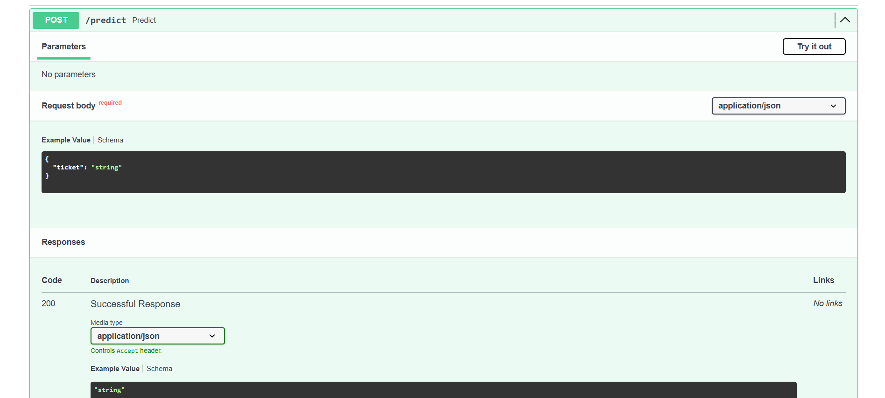

# Auto_Email _Ticket_Categorizer

## Project Overview

This project is an NLP-based Support Ticket Classification System that automatically routes incoming support tickets to the appropriate department using Machine Learning.

The system preprocesses ticket text, converts it into numerical features using TF-IDF Vectorization, and predicts one of the following categories:

* Billing
* Technical
* HR
* General

The project simulates a real-world helpdesk ticket triage system where incoming requests are automatically categorized before reaching the appropriate team.

---

## Features

* Text preprocessing
* TF-IDF Vectorization
* Logistic Regression Classifier
* FastAPI REST API
* Confidence Score Prediction
* Human Review Threshold
* Priority Detection (High / Normal)
* Real-time Prediction

---

## Technologies Used

* Python
* Pandas
* Scikit-learn
* FastAPI
* Joblib
* Uvicorn

---

## Dataset

A synthetic (dummy) dataset was created specifically for this assessment as instructed. It contains realistic support tickets categorized into Billing, Technical, HR, and General classes.

---

## Model Pipeline

1. Load Dataset
2. Text Preprocessing
3. TF-IDF Vectorization
4. Train Logistic Regression Model
5. Save Model and Vectorizer
6. Predict New Tickets via FastAPI

---

## API Endpoint

### POST `/predict`

Example Request

```json
{
    "ticket": "My laptop is not working after the latest update."
}
```

Example Response

```json
{
    "predicted_department": "Technical",
    "confidence": 0.97,
    "priority": "High"
}
```

If the confidence score is below the predefined threshold, the ticket is flagged as **Needs Human Review** instead of being automatically assigned.
## FastAPI Swagger UI



